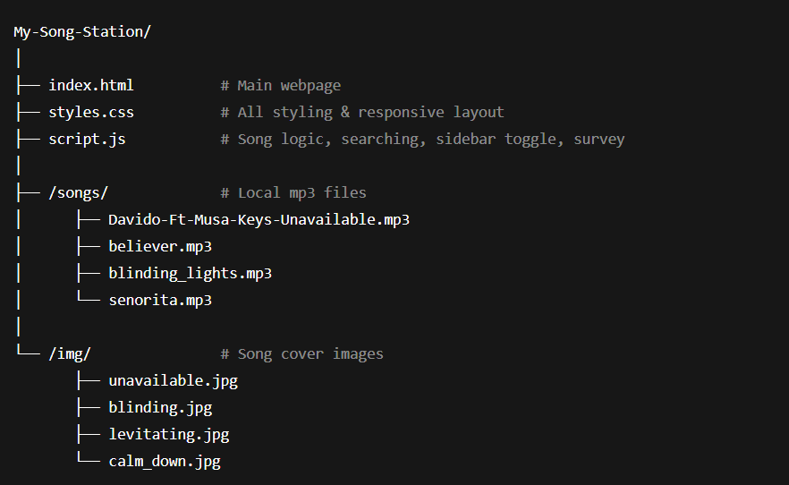
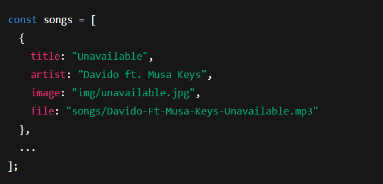
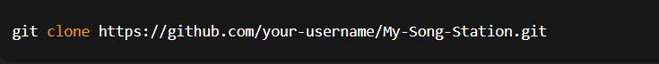
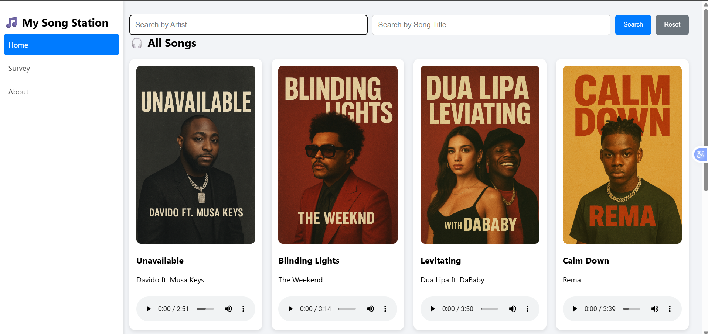
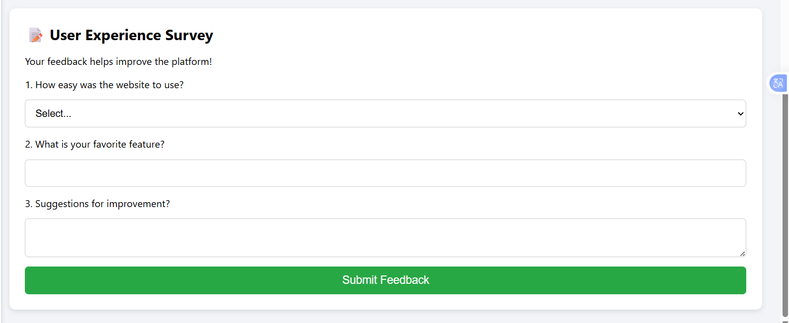

# 🎵 My Song Station

#### A modern, responsive mini-music website that allows users to browse, search, and play songs — plus interact with a simple user survey.
Designed to look clean, smooth, and professional.

# 📌 Features
## 🔍 Song Browsing & Search

   ### * Displays all available songs with:
             * Song title
             * Artist
             * Album cover
             * Playable audio

    ### * Search by:
             * Artist name
             * Song title

    ### * Reset button to return all songs

## 🎼 Audio Playback
### Every song has its own audio player
### Supports play, pause, seek, and volume controls
###Uses local .mp3 files for fast playback

## 📱 Fully Responsive UI
### Clean sidebar navigation
### Collapsible hamburger menu on smaller screens
### Smooth slide-in/slide-out sidebar
### Hamburger icon disappears while scrolling down (for better viewing space)
### Song cards adjust to all screen sizes:
        * Phone
        * Tablet
        * Desktop

## 📝 User Survey
### Collects user feedback
### Simple dropdown + text input
### Auto-reset after submission
### Thank-you popup message

## 🎨 Beautiful Modern Design
### Soft shadows
### Rounded edges
### Smooth hover effects
### Clean, minimalist light theme

# 🗂️ Project Structure

# ⚙️ How It Works
## ▶️ Song Rendering
### Songs are stored inside script.js:

# 🚀 How to Run the Project
## 1: Download or clone the repository:

## 2: Make sure your folder structure remains the same (img/ and songs/ must not be renamed)
## 3: Open index.html in any browser:

### No backend or server required — everything runs in the browser.

# 🛠️ Technologies Used

## HTML5
## CSS3
## JavaScript (ES6)

# 📸 Screenshots

# 🤝 Contributing
## Feel free to fork this repo and submit a pull request!

# 📄 License
## This project is free for personal or educational use.
